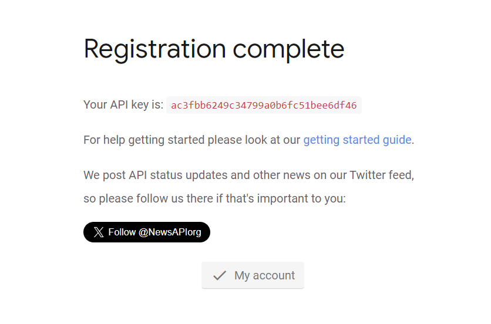

# Weather App

Weather App is a web application that provides users with current weather information, extended forecasts, and the latest news for a specified city.


## Description

Weather App is designed to offer users a comprehensive overview of the weather conditions in a given city. It fetches real-time weather data, extended forecasts for the next 14 days, and the latest news related to the specified location.

## Features

- Real-time weather information
- 14-day extended weather forecast
- Latest news related to the specified city

## Installation

To install the Weather App, follow these steps:

1. Clone the repository:

   ```bash
   git clone https://github.com/your-username/weather-app.git
   cd weather-app


#### How to Obtain API Key (example):
1. Visit [OpenWeatherMap](https://openweathermap.org/) and sign up for a free account.
2. After signing in, navigate to the "API Keys" section to obtain your API key.



## API's
### OpenWeather API
- [OpenWeather](https://openweathermap.org/price) provides real-time weather data.
 
### Visual Crossing Weather API
- [Visual Crossing Weather](https://www.visualcrossing.com/weather-data-editions) offers a 14-day weather forecast.

### Google Maps API
- Google Maps is used to display the location of the city on the map.

### News API
- [News API](https://newsapi.org/) provides news articles based on the specified city.
